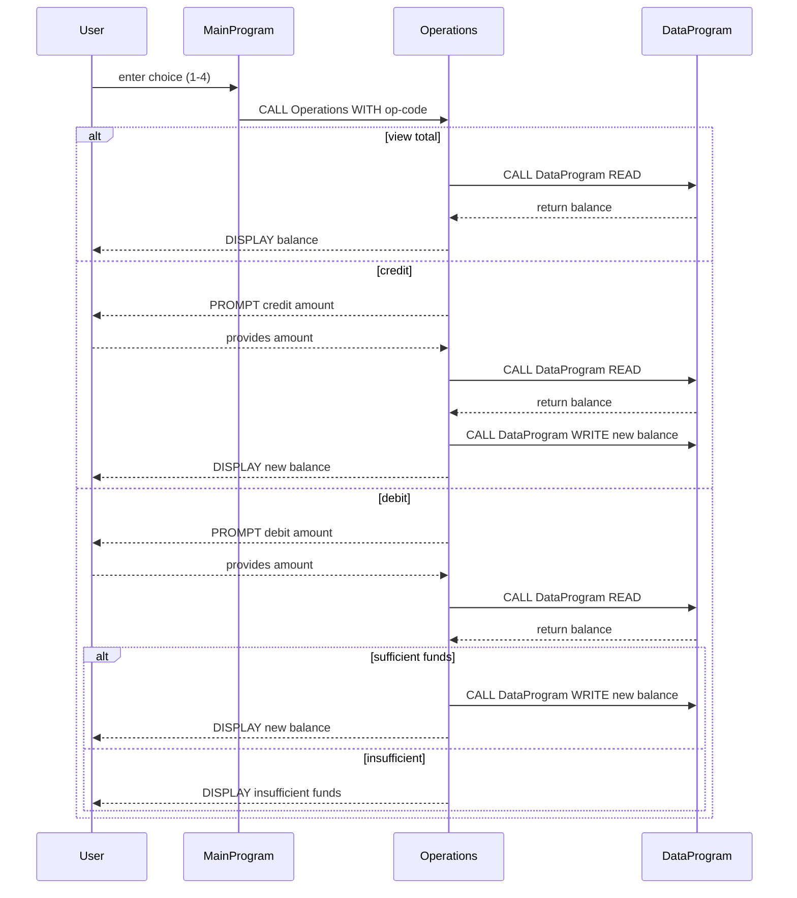

# COBOL Account Management Documentation

This directory contains documentation for the legacy COBOL programs located in `src/cobol`.  The suite simulates a simple account management system that might be used for student accounts or similar financial records.  Each file has a specific role in the overall workflow:

## Overview of Files

| COBOL Source File | Purpose |
|-------------------|---------|
| `main.cob`        | Entry point providing a text-based menu for users to view balance, credit, debit, or exit. Delegates operations to `Operations` program. |
| `operations.cob`  | Contains business logic for processing account actions (view total, credit, debit). Calls `DataProgram` to read or write persistent balance. |
| `data.cob`        | Simulates data storage by maintaining a working-storage balance. Offers simple read/write interface to other programs via linkage section. |

---

## `main.cob` (MainProgram)

- **Function:** Presents the user interface and handles menu selection.
- **Key routines:** `MAIN-LOGIC` loop with `EVALUATE` statement directing the chosen operation.
- **Interactions:** Calls `Operations` with a six-character operation code (`'TOTAL '`, `'CREDIT'`, `'DEBIT '`).

## `operations.cob` (Operations)

- **Function:** Implements the core account operations.
- **Key logic branches:**
  - `TOTAL`: Reads the balance and displays it.
  - `CREDIT`: Prompts for an amount, reads current balance, adds amount, writes back updated balance, displays result.
  - `DEBIT`: Prompts for an amount, reads current balance, checks if sufficient funds are available before subtracting and writing back. Insufficient funds trigger an error message.
- **Important business rules:**
  - **No overdraft:** Debits are only allowed when the requested amount does not exceed the current balance.
  - **Persistence contract:** All balance modifications are routed through the `DataProgram` to ensure a consistent source of truth.

## `data.cob` (DataProgram)

- **Function:** Acts as a rudimentary data layer for account balances.
- **Key features:**
  - Maintains `STORAGE-BALANCE` in working-storage (initialized to `1000.00`).
  - Supports two operations via parameters: `'READ'` (returns current balance) and `'WRITE'` (updates stored balance).
- **Usage notes:** This program abstracts the concept of persistent storage; in a real modernization effort, this would map to a database or file.

## Business Rules and Student Account Context

While the sample code doesn't explicitly reference "students," the terminology and rules are generic to any simple account system. If this were used for student accounts, the following would apply:

1. **Account Balance Integrity:** Each student account begins with a default balance (`1000.00`).
2. **Crediting an Account:** Increases the student's balance by the specified amount. No upper limit check is implemented here.
3. **Debiting an Account:** Decreases the balance only if sufficient funds exist; otherwise the operation is rejected. This prevents negative balances.
4. **Viewing Balance:** Allows students or administrators to check the current available funds.

## Next Steps for Modernization

- Replace `DataProgram` storage mechanism with an actual database or external storage API.
- Add error handling for invalid input (non-numeric amounts, out-of-range choices).
- Expand the domain model to include multiple accounts, student identifiers, and transaction histories.

---

*Generated on February 25, 2026*

---

## Sequence Diagram

Below is a Mermaid-formatted sequence diagram illustrating the data flow through the COBOL account management application.

